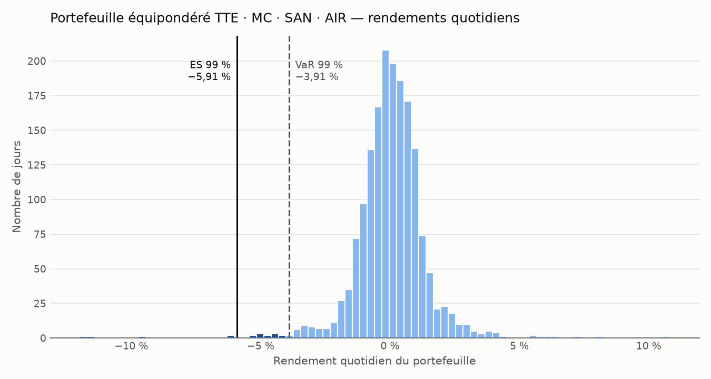

# market-risk-toolkit

**Outil Python d'analyse du risque de marché d'un portefeuille : Value at Risk, Expected Shortfall, ratio de Sharpe, drawdown.**

Projet personnel en cours, mené en parallèle de mon Master Finance Quantitative — Analyse du Risque de Marché (Université de Montpellier).

---

## Objectif

Sur les marchés, un rendement n'a de sens qu'au regard du risque pris pour l'obtenir. Ce projet construit un outil qui répond aux questions d'un gestionnaire de risque face à un portefeuille :

- **Combien puis-je perdre demain, dans 99 % des cas ?** → Value at Risk
- **Et dans le 1 % restant, combien je perds en moyenne ?** → Expected Shortfall
- **Suis-je correctement rémunéré pour le risque pris ?** → ratio de Sharpe
- **Quelle a été la pire chute traversée ?** → drawdown maximal

C'est un outil d'**analyse**, il ne cherche ainsi pas à prédire les prix, mais à mesurer le risque et à dire où ces mesures atteignent leurs limites.

---

## Exemple : portefeuille de quatre actions françaises depuis 2020

Portefeuille équipondéré TotalEnergies, LVMH, Sanofi et Airbus, du 1er janvier 2020 à aujourd'hui — une période qui inclut le krach du Covid de mars 2020.



| Mesure | Valeur |
|---|---|
| Rendement annualisé | 7,58 % |
| Volatilité annualisée | 21,67 % |
| Ratio de Sharpe | 0,26 |
| Drawdown maximal | −45,06 % |
| VaR historique 99 % (1 jour) | 3,91 % — 391 € |
| VaR gaussienne 99 % (1 jour) | 3,14 % — 314 € |
| Expected Shortfall 99 % (1 jour) | 5,91 % — 591 € |

Les barres foncées sont les jours situés au-delà de la VaR : ce sont eux que l'Expected Shortfall résume.

---

## Méthodes

Toutes les mesures sont calculées sur les **rendements** quotidiens, et non sur les prix. Une série de prix n'est pas stationnaire (sa moyenne dérive avec le temps), alors qu'une série de rendements oscille autour d'un niveau stable, ce qui rend les calculs statistiques légitimes.

&nbsp;&nbsp;&nbsp;&nbsp;Rₜ = (Pₜ − Pₜ₋₁) / Pₜ₋₁

Le rendement du portefeuille est la moyenne pondérée des rendements de ses actifs :

&nbsp;&nbsp;&nbsp;&nbsp;Rₚ,ₜ = Σᵢ wᵢ · Rᵢ,ₜ

**Volatilité annualisée.** Écart-type des rendements journaliers, ramené à un an :

&nbsp;&nbsp;&nbsp;&nbsp;σ_annuelle = σ_journalière × √252

**VaR historique.** Aucune hypothèse de loi : on lit directement le centile 1 % des rendements observés.

&nbsp;&nbsp;&nbsp;&nbsp;VaR₉₉ = − quantile₁%(R)

**VaR gaussienne.** On suppose des rendements normaux de moyenne μ et d'écart-type σ :

&nbsp;&nbsp;&nbsp;&nbsp;VaR₉₉ = − (μ + z₀,₀₁ · σ),&nbsp;&nbsp;&nbsp;avec z₀,₀₁ ≈ −2,33

Comparer les deux VaR : les rendements financiers ont des queues plus épaisses que la loi normale, si bien que la VaR gaussienne sous-estime souvent le risque extrême.

**Expected Shortfall.** Perte moyenne lors des jours qui dépassent la VaR :

&nbsp;&nbsp;&nbsp;&nbsp;ES₉₉ = − E[ R | R ≤ quantile₁%(R) ]

C'est la mesure retenue par la réglementation bancaire (Bâle III, revue FRTB) à la place de la VaR, parce qu'elle rend compte de la gravité des pertes extrêmes, et pas seulement de leur seuil.

**Ratio de Sharpe.** Rendement obtenu au-dessus du taux sans risque, par unité de volatilité :

&nbsp;&nbsp;&nbsp;&nbsp;Sharpe = (R_annuel − r_f) / σ_annuelle

**Drawdown maximal.** Pire baisse entre un plus haut et le creux qui suit :

&nbsp;&nbsp;&nbsp;&nbsp;DDₜ = Vₜ / maxₛ≤ₜ Vₛ − 1&nbsp;&nbsp;&nbsp;&nbsp;MDD = minₜ DDₜ

---

## Structure du projet

```
market-risk-toolkit/
├── src/
│   ├── donnees.py        prix → rendements, agrégation en portefeuille
│   ├── risque.py         volatilité, VaR historique et gaussienne, Expected Shortfall
│   ├── performance.py    rendement annualisé, ratio de Sharpe, drawdown maximal
│   ├── analyse.py        relie tous les modules en un bilan unique
│   ├── visualisation.py  graphique de la distribution des rendements
│   └── format_fr.py      mise en forme des nombres à la française
├── tests/                vérification de chaque formule sur des cas connus
├── figures/              graphiques produits
└── exemple.py            analyse complète d'un portefeuille réel
```

Chaque outil vit dans son propre module ; `analyse.py` est le seul point qui les assemble. Ajouter un nouvel outil revient à écrire un module et à l'appeler depuis `analyse.py`, sans toucher aux autres.

---

## Installation et utilisation

```bash
git clone https://github.com/matthiasbailliez/market-risk-toolkit.git
cd market-risk-toolkit
python -m pip install -r requirements.txt
python exemple.py
```

Pour étudier un autre portefeuille, il suffit de modifier le dictionnaire `PORTEFEUILLE` en haut de `exemple.py` (codes Yahoo Finance et poids, dont la somme doit valoir 1).

## Tests

```bash
python -m pytest
```

Chaque formule est vérifiée sur un cas dont la réponse est connue à l'avance : calcul à la main (rendements, drawdown), formule fermée de la loi normale (VaR gaussienne), propriétés mathématiques.

---

## Feuille de route

**Phase 1 — Mesures de base** 
- [x] Rendements et agrégation en portefeuille
- [x] Volatilité annualisée, VaR historique, VaR gaussienne, Expected Shortfall
- [x] Ratio de Sharpe, drawdown maximal
- [x] Démonstration sur données réelles et graphique

**Phase 2 — Valider les modèles de risque**
- [ ] VaR de Student (queues épaisses) et VaR par simulation de Monte Carlo
- [ ] Backtest hors échantillon : calibration sur les 80 % les plus anciens de l'historique, test sur les 20 % les plus récents (découpage chronologique, jamais aléatoire)
- [ ] Test de Kupiec : le nombre de dépassements observés est-il compatible avec le niveau de confiance annoncé ?

**Phase 3 — Aide à la décision et produits dérivés**
- [ ] Limites de risque : alerte lorsque la VaR ou l'Expected Shortfall dépasse un budget fixé en pourcentage du capital
- [ ] Pricing d'options par Black-Scholes-Merton et grecs (delta, gamma, vega, theta, rho)
- [ ] Couverture en delta et mesure de l'erreur de couverture

**Phase 4 — Volatilité conditionnelle et apprentissage automatique**
- [ ] Modèle GARCH(1,1) et VaR dynamique
- [ ] Comparaison d'un modèle d'apprentissage automatique avec le GARCH comme référence : le modèle n'a d'intérêt que s'il fait mieux que cette référence, hors échantillon
- [ ] Rapport final : résultats, et limites concrètes (profondeur des données, ruptures structurelles, variables omises)

---

## Limites assumées

- **Les mesures ne sont pas encore validées hors échantillon.** Elles décrivent le risque passé ; le backtest de la phase 2 dira si elles auraient correctement anticipé le risque futur.
- **La VaR historique ne peut pas anticiper une perte plus forte que celles déjà observées** : sa qualité dépend entièrement de la période choisie.
- **La VaR gaussienne suppose des rendements normaux**, hypothèse connue pour sous-estimer les pertes extrêmes.
- **La règle de la racine du temps (√252) suppose des rendements indépendants.** Or la volatilité des marchés évolue par grappes, ainsi une journée agitée est souvent suivie d'autres.
- **Hypothèse : Le portefeuille est rééquilibré chaque jour à poids fixes, sans frais de transaction.**
- **Les données proviennent de Yahoo Finance**, une source gratuite non auditée ; le taux sans risque utilisé dans le Sharpe est une hypothèse fixée à la main.

---

*Matthias Bailliez — M1 Finance Quantitative, Analyse du Risque de Marché, Université de Montpellier*
